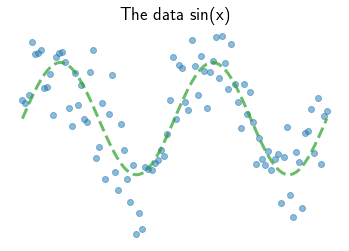

# Fitting a Sine signal

Sine signals are not lines. So how does a *linear* model fit a sine curve? Do nonlinear models work better? Let's try 10 different methods of modeling a sine curve. 

## A line

